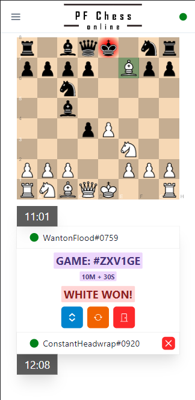
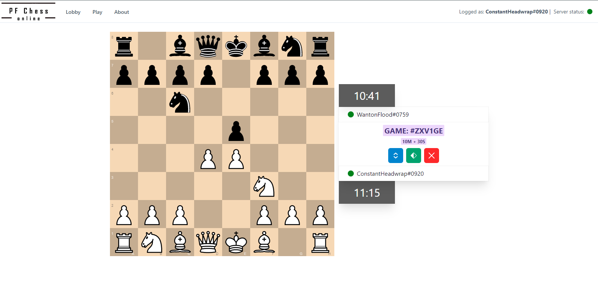
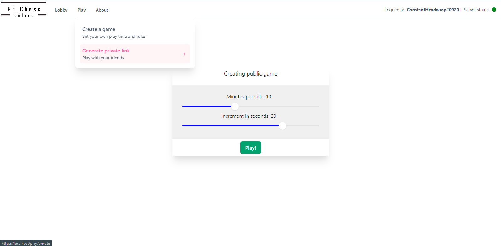
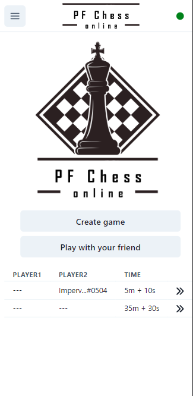

# Chess-online

Online chess platform written with Python & React

<p align="middle">
  
  
</p>

## Preview


Mobile                          |  Desktop
:------------------------------:|:-------------------------:
    | 

New game                        |  Lobby
:------------------------------:|:-------------------------:
 | 

## Requirements

- Docker

## Installation

```bash
git clone git@github.com:akcyp/chess-online.git
cd chess-online
docker-compose build
docker-compose up
```

## Development

You may need:
- Python3 v3.10.8 (backend)
- Node v19.2.0 (frontend)
- pnpm v7.19.0 (frontend, `corepack enable`)

```bash
# Run frontend development server
cd frontend
pnpm install
pnpm run dev
cd ..
# Run backend development server
cd backend
pip install -r -requirements.txt
python3 app.py
cd ..
```
